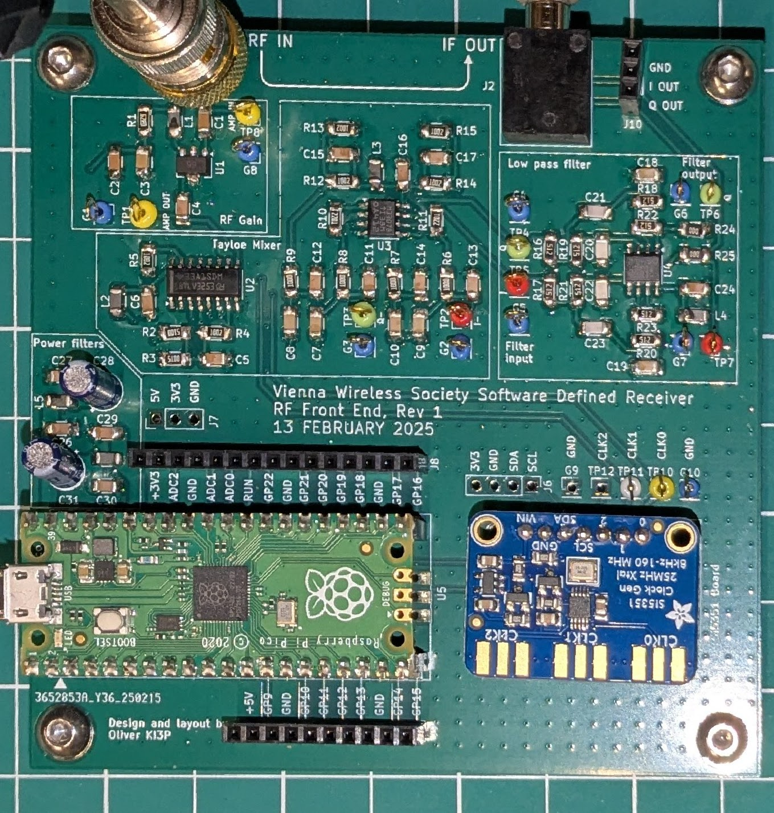
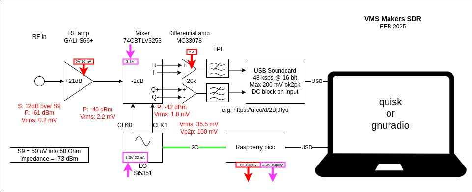
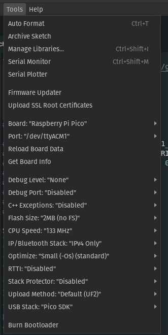
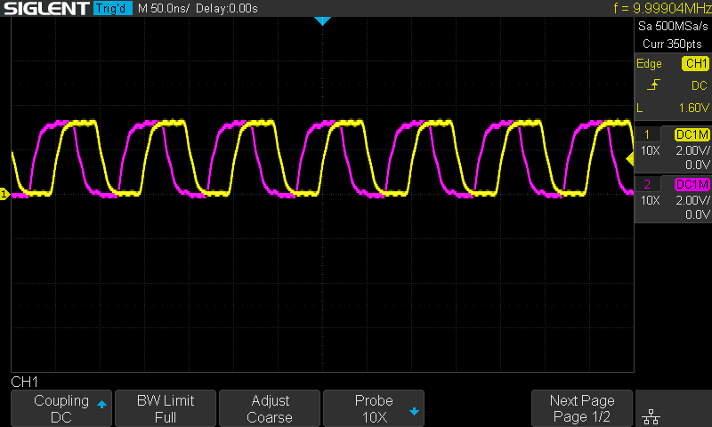
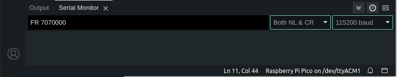
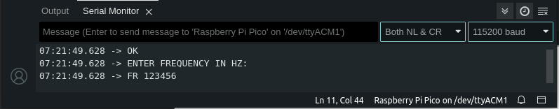
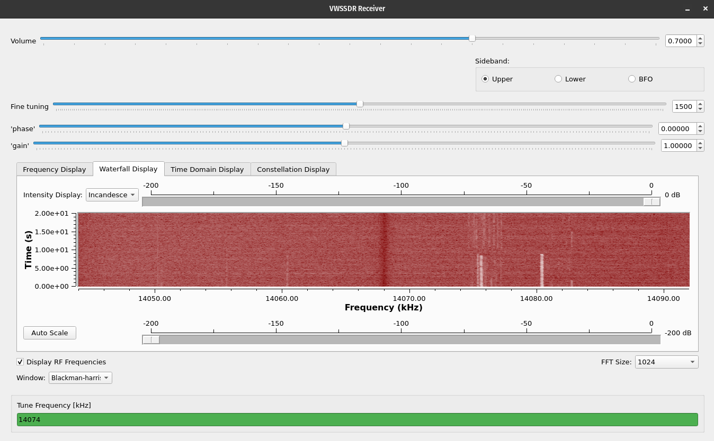
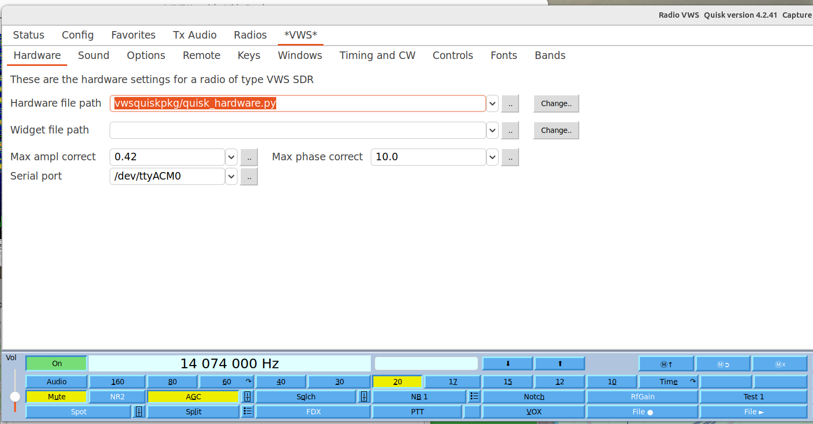
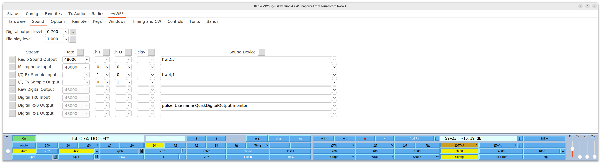
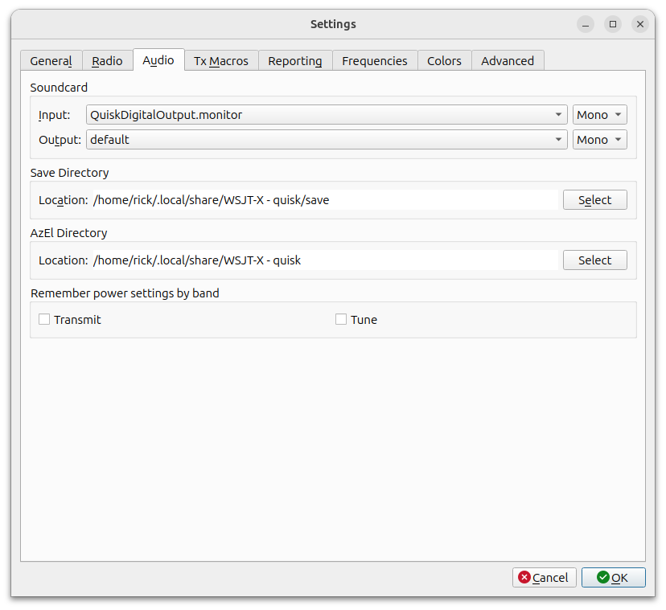

# Vienna Wireless Society Software Defined Receiver (VWS-SDR)

This repository contains the files for a 2025 project by the [Vienna Wireless Society's](https://viennawireless.net/wp/) Makers Group. This project aims to build the RF front end of a software defined receiver covering the HF bands. The goals of the project are: 

1. Learn how to use KiCAD, and 
2. Learn surface mount assembly techniques. 



## Credit

The VWS-SDR design draws heavily from the RF board of the T41-EP Software Defined Transceiver (SDT) originally designed by Al Peter-AC8GY and Jack Purdum-W8TEE. The T41-EP is a self-contain SDT that does not require an external PC, laptop, or tablet to use. Al and Jack wrote a book, available on [Amazon](https://www.amazon.com/dp/B0D25FV48C), describing the theory and operation of the T41-EP.

Thanks to Rick W1DSP for writing the Quisk integration, Barry KV4FV for the gnuradio demodulation flowgraph, the many T41 contributors for the hardware and software derived from that project, and to Leon NT8B, Dean KK4DAS, Mark KM4GML, Vlad K4LRZ, and Ed KQ4RVX for their help designing, building, and testing the prototypes.

## Design overview 

The VWS-SDR has stages shown in the block diagram below.

1. A gain stage based on the [GALI-S66+](https://www.minicircuits.com/WebStore/dashboard.html?model=GALI-S66%2B) MMIC amplifier.
2. A [Tayloe Mixer](http://norcalqrp.org/files/Tayloe_mixer_x3a.pdf) that uses quadrature signals generated by a [Si5351](https://www.digikey.com/en/htmldatasheets/production/1316951/0/0/1/si535x-tmstk) clock generator and a [74CBTLV3253](https://www.ti.com/product/SN74CBTLV3253) 2-channel analog multiplexer to mix the RF signals to IF.
3. An anti-aliasing low-pass filter followed by a USB soundcard to digitize the IF signal.
4. Demodulation is performed in software using [quisk](http://james.ahlstrom.name/quisk/) or [gnuradio](https://www.gnuradio.org/).



To modify the PCB design, download this repository to your computer. Open the `KiCad\VWS-SDR-ref-design.kicad_pro` file using the [KiCad](https://www.kicad.org/) EDA software package. This repository includes a few custom symbols and footprints that should automatically be added to your library lists by KiCad.

## Code

### Pico

You two equivalent choices for the code that will run on the Pico. If you prefer C code written in the Arduino framework, use that. If you prefer micropython code, load that code instead. 

#### Arduino framework

The `code/pico_sketch` folder contains an Arduino sketch to program the Pico. The sketch listens for ASCII commands on the USB serial bus (baud 115200) that match this format:

`FR 123456`

where `123456` is the frequency in Hertz that the Si5351 should be tuned to.

Open the sketch in the Arduino IDE and configure Arduino to have the settings shown below under the Tools menu. For “Port” select whatever COM port appears when you plug the Pico into your computer with a USB cable.



Then compile and load the sketch onto the pico by clicking the Upload button (Sketch->Upload).

The Pico sketch configures the Si5351 to produce 10 MHz tones on start. You can confirm this by connected an oscilloscope to the CLK0 and CLK1 outputs where you should see something like the screen shot below.



You can manually change the frequency using the Serial Monitor window in the Arduino. The Pico communicates at a baud rate of 115200 and expects commands in the form: “FR 123456” where 123456 is the frequency in Hz.

For instance, to tune the center of the band to 7070 kHz, enter the following command:



You should get the reply “OK” and an invitation to enter a new frequency. The CLK0 and CLK1 outputs should now show an output at 7070 kHz.



#### Micropython framework

The `code/pico_micropython` folder contains micropython code for the Pico written by Rick W1DSP. It works similarly to the Arduino sketch, the only difference is commands are terminated by a newline (`\n`) in the Python code, versus carriage return (`\r`) in the sketch. If the preferred tuner is the sketch, just edit this line in `code/VWS-Quisk/vwsquiskpkg/quisk_hardware.py`:

```python
   self.serial.write(b'FR %d\r'%(vfo+correction))
```

And change to `\r` to `\n`.  The original thinking in using Python for the VWS was to facilitate the extensive driver libraries Adafruit provides for their peripherals, as well as the ease of use and velocity of development Python brings to low speed control applications.

To install the Python tuner, the Pico must first be loaded with CircuitPython as described [here](https://learn.adafruit.com/getting-started-with-raspberry-pi-pico-circuitpython/circuitpython). Once CircuitPython is installed and booted, you will see a virtual disk drive for the board appear.  On my machine it is `/media/rick/CIRCUITPY`.

To run the tuner, copy `code/pico_micropython/{code.py,vws_tuner.py}`
to the virtual disk drive, and power cycle the board.  To verify operation, connnect to the serial port associated with the board (here, it is `/dev/ttyACM0`, 115200 bps), and type a carriage return.  You should see a `tune>` prompt, and entering a command like `FR 7074000` will cause the 5351 to tune to 7.074 Mhz. As required by the VWS SDR designs, clk0/clk1 are in quadrature. The Python script works similarly to various 5351 libraries to generate quadrature clocks: PLLA is a integer multiple of the desired frequency (factor of 4).


### Computer

Demodulation of the audio can be done in gnuradio or Quisk.

#### Gnuradio

Credit to Barry KV4FV for his contributions to the gnuradio code.

The `code/gnuradio_KI3P` contains a [gnuradio](https://wiki.gnuradio.org/index.php/InstallingGR) flowgraph to display the received signal and perform audio demodulation. It also allows you to adjust the gain and phase balance between the L and R channels to improve sideband separation if needed.



#### Quisk

Credit to Rick W1DSP for the Quisk code and instructions. Quisk links:

* [Quisk documentation](https://james.ahlstrom.name/quisk/docs.html)
* [Quisk github](https://github.com/jimahlstrom/quisk)
* [Install Quisk](https://james.ahlstrom.name/quisk/docs.html#Installation)

##### Install VWS-Quisk package

Once quisk is installed, copy the `code/VWS-Quisk/vwsquiskpkg` directory into the quisk distribution directory. On my computer this is:

* `/usr/lib/python3/dist-packages/quisk`

Note: This is the way new radios are introduced to the quisk radio configuration manager: for a new radio named `xyzzy`, you create a directory named `xyzzypkg` in the quisk directory, and write a `quisk_hardware.py` module.  Python class inheritance will define most of the necessary routines, but functionally you'll want open/close/tune method as shown in the `vwsquiskpkg` version.

##### Configure Quisk

Launch quisk.

To add the VWS SDR as a radio, click the Config Button, then select the Radios tab. In the Radios config panel, select the "Add a new radio with the general type", and select the VWS SDR item, name the radio "VWS"



You should see a new Radio appear just below the title bar named "VWS".  Click that item, and then select the Hardware tab.  Enter the serial port name (in my case it was `/dev/ttyACM0`). Click the Sound tab, and choose appropriate settings for "Radio Sound Output" and "Microphone Input" that correspond to your soundcard.  In Digital Rx0 line, select `pulse: Use name QuiskDigitalOutput.monitor`.  Of course, you'll need to have loaded the pulse audio system.  Note that I have not tested any of this on Mac or Windows, and wouldn't expect it to work out of the box on either system type.



Back on the Config->Radios screen, select VWS in the "When Quisk starts, use the radio" line. In the Config tab, quisk provides the ability to adjust IQ balance via "Adjust receive amplitude and phase".  I manually adjusted this using a signal generator tuned to the vicinity of 14.074 mhz, and then saved the result.

##### Configure WSJT-X if desired

To use the WSJT-X integration, use the package manager to install wsjtx, or build from source. 

I've been starting wsjtx manually within quisk: Click Config, select the Config tab, then look for the Start WSJT-X item.  The drop down menu has an option Main Rx0 Now item - select that and quisk will start the wsjtx application.  Once you've fully debugged the quisk:wsjtx integration,
setting "Start WSJT-X" to "Main Rx0 on startup" on the Config menus, Config tab will automatically start up wstjx when quisk starts.

The included screen captures show some of the details of getting quisk to interoperate with wsjtx.  Note that quisk won't stream audio on `QuiskDigitalOutput.monitor` unless you're in a digital mode (see DGT-U).



Quisk can be controlled by hamlib.  In the Config screens, select the VWS radio, then Remote tab.  On the Remote config screen, set the port to 4532.  You'll have to restart quisk for the setting to take effect.  After this is done, you can use `rigctl -m 2` to test: for example, the command `F 14074000` will tune quisk to the FT8 band on 20M.  Once the hamlib integration has been confirmed as working, you'll be able to control quisk via the wsjtx application, i.e. switching bands, frequencies in that app, and quisk following along as a normal radio would.
