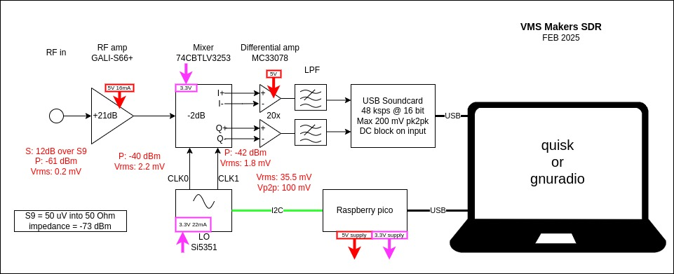

# Vienna Wireless Society Software Defined Receiver (VWS-SDR)

This repository contains the files for a 2025 project by the [Vienna Wireless Society's](https://viennawireless.net/wp/) Makers Group. This project aims to build the RF front end of a software defined receiver covering the HF bands. The goals of the project are: 

1. Learn how to use KiCAD, and 
2. Learn surface mount assembly techniques. 

The VWS-SDR design draws heavily from the RF board of the T41-EP Software Defined Transceiver (SDT) originally designed by Al Peter-AC8GY and Jack Purdum-W8TEE. The T41-EP is a self-contain SDT that does not require an external PC, laptop, or tablet to use. Al and Jack wrote a book, available on [Amazon](https://www.amazon.com/dp/B0D25FV48C), describing the theory and operation of the T41-EP.

## Design overview 

The VWS-SDR has stages shown in the block diagram below.

1. A gain stage based on the [GALI-S66+](https://www.minicircuits.com/WebStore/dashboard.html?model=GALI-S66%2B) MMIC amplifier.
2. A [Tayloe Mixer](http://norcalqrp.org/files/Tayloe_mixer_x3a.pdf) that uses quadrature signals generated by a [Si5351](https://www.digikey.com/en/htmldatasheets/production/1316951/0/0/1/si535x-tmstk) clock generator and a [74CBTLV3253](https://www.ti.com/product/SN74CBTLV3253) 2-channel analog multiplexer to mix the RF signals to IF.
3. An anti-aliasing low-pass filter followed by a USB soundcard to digitize the IF signal.
4. Demodulation will be performed in software using [quisk](http://james.ahlstrom.name/quisk/).

## Instructions

Download this repository to your computer. Open the `KiCad\VWS-SDR-ref-design.kicad_pro` file using the [KiCad](https://www.kicad.org/) EDA software package. This repository includes a few custom symbols and footprints which should automatically be added to your library lists by KiCad.